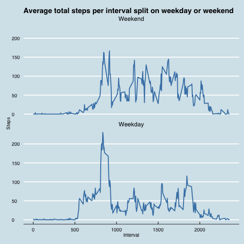

It is now possible to collect a large amount of data about personal movement using activity monitoring devices such as a Fitbit, Nike Fuelband, or Jawbone Up. These type of devices are part of the “quantified self” movement – a group of enthusiasts who take measurements about themselves regularly to improve their health, to find patterns in their behavior, or because they are tech geeks. But these data remain under-utilized both because the raw data are hard to obtain and there is a lack of statistical methods and software for processing and interpreting the data.

This analysis below makes use of data from a personal activity monitoring device. This device collects data at 5 minute intervals through out the day. The data consists of two months of data from an anonymous individual collected during the months of October and November, 2012 and include the number of steps taken in 5 minute intervals each day.

## Loading and preprocessing the data
Below, the data is loaded and processed into suitable forms for doing calculations. 
In addition to the orignal data set, which is imported as a data frame named activity, 
two dataframes containing the total number of steps per day, named perDay, and mean number of 
steps per interval, named perInterval, are created. 

###Clear the namespace and load any required modules. 

```r
rm(list=ls())
library(ggplot2)
library(ggthemes)
library(reshape2)
library(lubridate)
```

### Load the data and preproccess it. 
  

```r
#This assumes that the rmd file is in the same directory as the data
activity <- read.csv('activity.csv')

#Use the aggregate function to compute the total steps per day and mean steps per interval
#and place in a new data frame. 
#Calculate the total number of steps per day
perDay <- aggregate(activity$steps, by = list(activity$date), FUN = sum, na.rm= TRUE)
names(perDay)<- c('Date', 'steps') 

#Calculate the mean number of steps aggregated by interval
perInterval <- aggregate(activity$steps[complete.cases(activity)], by = list(activity$interval[complete.cases(activity)]), FUN = mean, na.rm=TRUE)
names(perInterval)<- c('Interval', 'Steps') 
```

## What is mean total number of steps taken per day?
To determine this, a histogram is first drawn using ggplot on the perDay data frame 
and the mean and median values are calculated using this data frame. 
1. Make a histogram of the total number of steps taken each day?


```r
#calculate the mean and median
meanSteps<- mean(perDay[[2]],na.rm=TRUE)
medianSteps<-median(perDay[[2]],na.rm=TRUE)

#create a data frame to hold the mean and median which will be displayed on the graph below
xintercepts = data.frame(vals = c(meanSteps, medianSteps), Stat = c('Mean', 'Median'))

#Plot with ggplot
p1 <- ggplot(data = perDay, aes(x =steps)) +
        labs(x= 'Total number of steps per day', y= 'Count', title='Histogram of steps per day') +
        ylab('Count') + 
        geom_histogram(binwidth = 1250, color = 'black', fill = 'grey') +
        geom_vline(data = xintercepts, aes(xintercept= vals, color = Stat), show_guide = TRUE, size =1.2) +
        theme_economist()
p1
```

 

2. Calculate and report the mean and median total number of steps taken per day.


```
## The mean number of steps per day is 9354.23, and the median number of steps per day is 10395.
```

## What is the average daily activity pattern?
This analysis relies on the perInterval data frame, which is generated in the cells above using the aggregate function. 

1. Make a time series plot (i.e. type = "l") of the 5-minute interval (x-axis) and the average number of steps taken, averaged across all days (y-axis).


```r
#Use ggplot to create a graph of the time series of the number of steps per interval. 
p2<- ggplot(perInterval, aes(x= Interval, y= Steps))+
        geom_line(size =0.9, color = 'steelblue') + 
        theme_economist() + 
        ggtitle('Average total Steps per interval')
p2
```

 

2. Which 5-minute interval, on average across all the days in the dataset, contains the maximum number of steps?


```
## On average across all days, The 104th interval has the greatest number of steps.
```

## Imputing missing values
Note that there are a number of days/intervals where there are missing values (coded as NA). 
The presence of missing days may introduce bias into some calculations or summaries of the data.

1. Calculate and report the total number of missing values in the dataset (i.e. the total number of rows with NAs).


```r
#Calculate the number of total number of missing values in the data set
totalMissing = sum(is.na(activity[[1]]))
```


```
## There are 2304 values in the data set.
```

2. Devise a strategy for filling in all of the missing values in the dataset. The strategy does not need to be sophisticated. For example, you could use the mean/median for that day, or the mean for that 5-minute interval, etc.
3. Create a new dataset that is equal to the original dataset but with the missing data filled in.

I will use the mean value for the 5-minute interval to imput the missiving values. 
A more sophisticated approach would be to use a loess esimator or to rolling average,
however this method is easier to implement. 
The code below:
1. Copies the original data into a new data frame. 
2. Uses a for loop to identify missing values and maps the mean values for a given interval into that location. 


4. Make a histogram of the total number of steps taken each day and Calculate and report the mean and median total number of steps taken per day. Do these values differ from the estimates from the first part of the assignment? What is the impact of imputing missing data on the estimates of the total daily number of steps?

The code below computes the mean and median values, and draws a histogram using 
the imputed data. 


```r
#Calculate the total number of steps per day and place in a new dataframe using the aggregate function. 
perDay.imputed <- aggregate(activity.imputed$steps, by = list(activity.imputed$date), FUN = sum, na.rm= TRUE)
names(perDay.imputed)<- c('Date', 'steps') 

#calculate the mean and median
meanSteps.imputed<- mean(perDay.imputed[[2]],na.rm=TRUE)
medianSteps.imputed<-median(perDay.imputed[[2]],na.rm=TRUE)

#create a data frame to hold the mean and median which will be displayed on the graph below
xintercepts = data.frame(vals = c(meanSteps.imputed, medianSteps.imputed), Stat = c('Mean', 'Median'))

p3 <- ggplot(data = perDay.imputed, aes(x =steps)) +
         labs(x= 'Total Number of Steps per Day', y= 'Count', title='Histogram of steps per day for imputed dataset') +
        geom_histogram(binwidth = 1250, color = 'black', fill = 'grey') +
        geom_vline(data = xintercepts, aes(xintercept= vals, color = Stat), show_guide = TRUE, size =1.2) +
        theme_economist()
p3
```

 

Comparing the histograms generated from the orignal data and imputed data suggests that by imputing the data, one is making the distribution appear more symetrical and normal. 


```
## The imputed data set has a mean 10766.19 number of steps and a median 10766.19 number of steps. These value are different from the mean and and median values of 9354.23 and 10395 computed for the original data. Note that the new median and mean values are closer to each other than for the orignal data.
```

## Are there differences in activity patterns between weekdays and weekends?

1. Create a new factor variable in the dataset with two levels – “weekday” and “weekend” indicating whether a given date is a weekday or weekend day.

To create a factor variable that denotes whether a given date is a weekend or a weekday, 
the date columnn is first converted to a date object using the lubridate ymd function. 
Then the lubridate wday function is used to map the date object to a vector of integers 
representing the day of the week with 1 representing Sunday, 7 representing Saturday. 
This vector is then converted to a boolean (FALSE if wday ==1 or 7) and converted the the appropriate 
factor variable title weekday. 


```r
#First convert the date column to actual dates using lubridate
activity.imputed$date<- ymd(activity.imputed$date)

#create a factor vector that denotes whether the day is a weekend or weekday
#Use the wday function from lubridate to determine the week days. 
weekday<- wday(activity.imputed$date)
#convert this to a boolean
weekday<- weekday >1 &weekday<7   #1 is sunday, 7 is saturday. 
#convert this to factor
weekday<- factor(weekday)
#change the level names
levels(weekday)<- c('Weekend','Weekday')
#attach this the factor the orignal data set
activity.imputed$weekday<- weekday
```

2. Make a panel plot containing a time series plot (i.e. type = "l") of the 5-minute interval (x-axis) and the average number of steps taken, averaged across all weekday days or weekend days (y-axis). 

First a new data frame with the data aggregating the mean step values by the interval and weekday factor is performed. 
This data set is then used to create the plot. 

 

As the time series demonstrates, the user (not surpisingly) has very different activity levels on the weekdays versus the weekends. 
